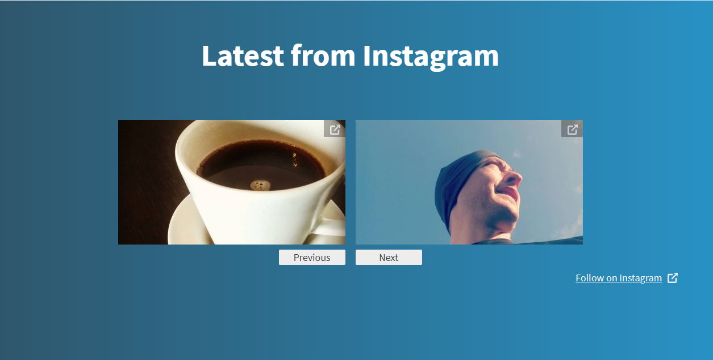

# Instagram Display Extension

Author: Anders Björkland
Contact: contact@andersbjorkland.online
Twitter: [@abjorkland](https://twitter.com/abjorkland)

This Bolt extension can be used to display your Instagram posts on your website. 
Add ```` to a template where you want to display it.

An example usage with the *base-2021* theme:
```twig
<section class="border-b py-6">
    <div class="container max-w-5xl mx-auto m-8">
        <h2 class="w-full my-2 text-5xl font-bold leading-tight text-center text-white">Latest from Instagram</h2>
        
    </div>
</section>
```

The resulting section would look like this:

*In this example the results_per_page is set to 2.*

assets/instagram-display.mp4

## Installation:

```bash
composer require andersbjorkland/instagram-display-extension
```

When installing this extension, there will be two tables added to your database:  
* bolt_instagram_token - used for storing your instagram token.
* bolt_instagram_media - used for storing meta-information about Instagram images and video.

When using this extension, you will be fetching media via [Instagram Basic Display](https://developers.facebook.com/docs/instagram-basic-display-api). 
A Facebook developer account is required. You can then create an app with the Instagram Basic Display product. 
Use https://mydomain.com/extensions/instagram-display/ for "Valid OAuth Redirect URIs" field.
Use https://mydomain.com/extensions/instagram-display/deauthorize for "Deauthorize Callback URL" field.
Once this is done, you will find **Instagram App ID** and **Instagram App Secret**. Add these as environment variables on the form as:  

```bash
INSTAGRAM_APP_ID=your_add_id
INSTAGRAM_APP_SECRET=your_app_secret
```

This extension will look for these environment variables and use them when you authenticate your website with your Instagram account, 
and on the api-calls to fetch media from your Instagram account.  
  
If you need to add a table manually you can execute these commands:  

* MySQL:
```bash
php bin/console doctrine:query:sql "CREATE TABLE IF NOT EXISTS bolt_instagram_token (id INT AUTO_INCREMENT NOT NULL, token VARCHAR(255) DEFAULT NULL, expires_in DATETIME DEFAULT NULL, instagram_user_id VARCHAR(255) DEFAULT NULL, PRIMARY KEY(id))"

php bin/console doctrine:query:sql "CREATE TABLE IF NOT EXISTS bolt_instagram_media (id INT AUTO_INCREMENT NOT NULL, instagram_id VARCHAR(255) NOT NULL, media_type VARCHAR(255) NOT NULL, caption LONGTEXT CHARACTER SET utf8mb4 COLLATE utf8mb4_unicode_ci DEFAULT NULL, timestamp VARCHAR(255) NOT NULL, filepath VARCHAR(255) DEFAULT NULL, instagram_url TEXT DEFAULT NULL, permalink VARCHAR(255) DEFAULT NULL, instagram_username VARCHAR(255) DEFAULT NULL, PRIMARY KEY(id))"
```

* SQLite:
```bash
php bin/console doctrine:query:sql "CREATE TABLE IF NOT EXISTS bolt_instagram_token (id INTEGER PRIMARY KEY AUTOINCREMENT NOT NULL, token VARCHAR(255) DEFAULT NULL, expires_in DATETIME DEFAULT NULL, instagram_user_id VARCHAR(255) DEFAULT NULL)"

php bin/console doctrine:query:sql "CREATE TABLE IF NOT EXISTS bolt_instagram_media (id INTEGER PRIMARY KEY AUTOINCREMENT NOT NULL, instagram_id VARCHAR(255) NOT NULL, media_type VARCHAR(255) NOT NULL, caption CLOB DEFAULT NULL, timestamp VARCHAR(255) NOT NULL, instagram_url VARCHAR(255) NOT NULL, filepath VARCHAR(255) DEFAULT NULL, permalink VARCHAR(255) DEFAULT NULL, instagram_username VARCHAR(255) DEFAULT NULL)"
```

* PostgreSQL:
```bash

php bin/console doctrine:query:sql "CREATE TABLE IF NOT EXISTS bolt_instagram_token (id INT NOT NULL, token VARCHAR(255) DEFAULT NULL, expires_in TIMESTAMP(0) WITHOUT TIME ZONE DEFAULT NULL, instagram_user_id VARCHAR(255) DEFAULT NULL, PRIMARY KEY(id))"

php bin/console doctrine:query:sql "CREATE TABLE IF NOT EXISTS bolt_instagram_media (id INT NOT NULL, instagram_id VARCHAR(255) NOT NULL, media_type VARCHAR(255) NOT NULL, caption TEXT DEFAULT NULL, timestamp VARCHAR(255) NOT NULL, filepath VARCHAR(255) DEFAULT NULL, instagram_url VARCHAR(255) DEFAULT NULL, permalink VARCHAR(255) DEFAULT NULL, instagram_username VARCHAR(255) DEFAULT NULL, PRIMARY KEY(id))"

php bin/console doctrine:query:sql "CREATE SEQUENCE IF NOT EXISTS instagram_token_id_seq INCREMENT BY 1 MINVALUE 1 START 1"

php bin/console doctrine:query:sql "CREATE SEQUENCE IF NOT EXISTS instagram_media_id_seq INCREMENT BY 1 MINVALUE 1 START 1"
```


### *Removing*  
If you don't want to be using the Instagram Display Extension, you may want to remove the corresponding database tables.

* MySQL
```bash
php bin/console doctrine:query:sql 'DROP TABLE bolt_instagram_token'
php bin/console doctrine:query:sql 'DROP TABLE bolt_instagram_media'
```

* SQLite
```bash
php bin/console doctrine:query:sql 'DROP TABLE bolt_instagram_token'
php bin/console doctrine:query:sql 'DROP TABLE bolt_instagram_media'
```

* PostgreSQL
```bash
php bin/console doctrine:query:sql "DROP SEQUENCE instagram_token_id_seq CASCADE"
php bin/console doctrine:query:sql "DROP SEQUENCE instagram_media_id_seq CASCADE"
php bin/console doctrine:query:sql "DROP TABLE bolt_instagram_token"
php bin/console doctrine:query:sql "DROP TABLE bolt_instagram_media"
     
```

You may also want to remove any media files stored from Instagram. Clear these in public/files/instagram, the command for this is:  
```bash
 rm -rf public/files/instagram/
```

Using the Twig thumbnail function generates images under the directory public/thumbs. You'll find the Instagram media files under the thumbs-subdirectory corresponding to your chosen thumb-size. Using the default size will place the media-files at public/thumbs/400×300×c. Clear this directory with:  
```bash
 rm -rf public/thumbs/400×300×c/instagram/
```

### Configuration
The configuration file is found at ``config\extensions\andersbjorkland-instagramdisplayextension.yaml``. 

* You can configure upload location, though default *files/instagram* is recommended to make the thumbnail-function work. 

* Specify if you want the default style for the twig-partial (*_div.html.twig*) to be active.

* Specify height and width for the media-files. This will crop the image to the specified dimensions. Setting either to null will keep the media file's original aspect ratio. Setting both to null will keep the image's original size.

* Dictate what colors to use for the pagination button and links.

* Determine if you want to show video media, and weather it should be stored on your server.


## Feedback is Welcome
Please reach out to me at contact@andersbjorkland.online if you have suggestions for features or improvements. You may open issues and push requests for said issues as well.   
  
If you want use this code in your own extension you are free to do so as it is licensed under the MIT-license. Remember to provide the same generous license for the parts that is based off of this though.
